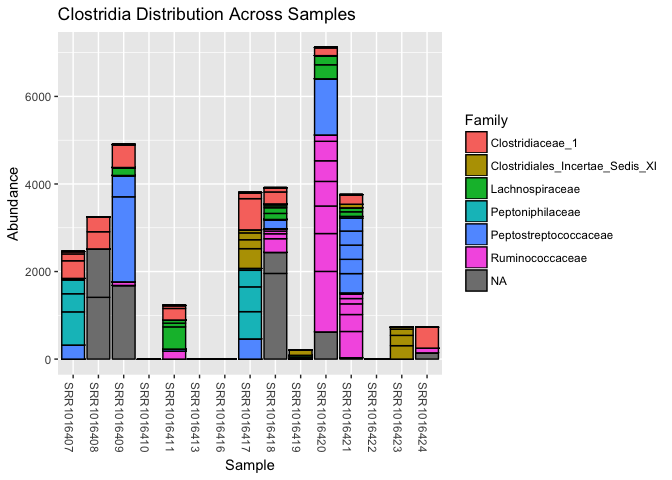
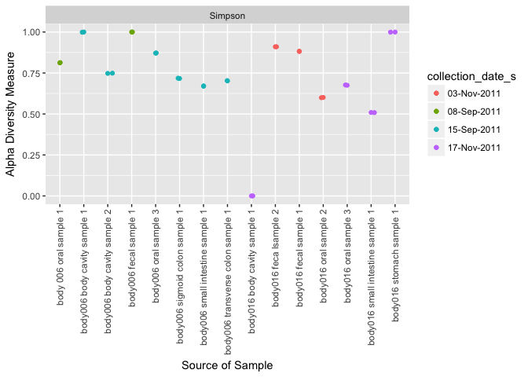

Final Report: Life After Death- The Prevailing Microbial Species of Recently-Deceased Individuals
================
Alfredo Hans Locht
November 29, 2017

Introduction
============

The decomposition of the human body, albeit an unpleasantly gross process, can yield many clues which forensic scientists and law enforcement use (Hauther *et al.*, 2015) to solve criminal investigations. In the first four minutes after a human dies, the body is depleted of oxygen and carbon dioxide begins to dissolve in the blood, creating carbonic acid and lowering the pH of the blood, causing cells to lyse (autolysis) and release their contents (Vass, 2001, 2011). These include many enzymes such a proteases and lipases which have digestive activities that begin the initial breakdown of bodily tissue and organs (Vass, 2001; Distinctive thanatomicrobiome signatures found in the blood and internal organs of humans, 2014; Cockle and Bell, 2015). Body organs which have high enzymatic activity such as the liver, or provide an aqueous environment that aids in providing the necessary ions for enzymatic catalysis such as the brain, tend to decompose faster than other organs, so there is a wide variability of rates at which specific sites on the body tends to decompose; however, the body can be characterized at each of the different stages of decomposition in summation (Hyde *et al.*, 2013, 2015; Distinctive thanatomicrobiome signatures found in the blood and internal organs of humans, 2014). The five stages of human decomposition include: Autolysis, Putrefaction, Bloat, Purge, and Saponification/Skeletonization. The rate at which is one occurs or lasts is highly dependent on a myriad of factors that up to date, have yet not been efficiently addressed (Hyde *et al.*, 2013, 2015).

Characterization of each step in the decomposition process is critical to law enforcement, forensic scientists and many other disciplines alike because they use these markers to reveal information about the Post Mortem Interval (PMI), or better known as the time since death (Comparison of decomposition rates between autopsied and non-autopsied human remains, 2016; Ferreira and Cunha, 2013; Hauther *et al.*, 2015; Hyde *et al.*, 2013). The time since death is a key contributor to solving investigations surrounding death because it will provide a time frame of the succession of events that lead up to that specific death. The PMI is obtained in a variety of ways using a variety of methods, but has previously relied on visual markers, chemical profile analyses, measurement of enzymatic activity, carbon dioxide-carbon evolution and other predominantly visual or chemically-based methods of analyses (Carter *et al.*, 2008; Ferreira and Cunha, 2013; Hauther *et al.*, 2015; Rosier *et al.*, 2015; Vass, 2011).

Each method of course, has its corresponding error rate which can overestimate or underestimate the PMI and lead to erroneous results (Cockle and Bell, 2015). For example, very frequently, validation of a specific PMI calculation derived by one set of researchers in a particular geographic location is only valid at that particular location because when tested in significantly different ecological and temperature climate, the studies cannot match the results expected or previously reported (Cockle and Bell, 2015). Furthermore, researchers often argue about which factors directly influence the PMI, so a consensus on how to develop methods which would measure certain sets of factors, has not been reached (Carter *et al.*, 2008; Cockle and Bell, 2015; Ferreira and Cunha, 2013). It also does not help that the identified list of potential factors influencing PMI estimations include endogenous factors such as body and fat mass, penetrating trauma, drug use, disease profile, and clothing as well as exogenous factors such as temperature, vegetation in the area, humidity, type of soil, and scavenger and insect access all compile to precisely paint the rate and pattern of a decomposition picture (Comparison of decomposition rates between autopsied and non-autopsied human remains, 2016; Carter *et al.*, 2008; Cockle and Bell, 2015; Hauther *et al.*, 2015). What this picture is missing however, are the organisms directly responsible for the process.

Interestingly, microbial communities have been outright dismissed by certain forensic scientists as having anything to do with the decomposition process of human corpses (Carter *et al.*, 2008), yet other sources explain that microbial decomposers are considered to have co-evolved with the presence of vertebrate corpses for the need to recycle complex biological molecules back into basic compounds and elements (Metcalf *et al.*, 2016).

Methods
=======

Study design
------------

(Hyde *et al.*, 2013) obtained cadavers donated to the Southeast Texas Applied Forensic Science (STAFS) Facility at the Center for Biological Field Studies (CBFS) at Sam Houston State University (SHSU). Both CBFS and STAFS are located in a humid, subtropical climate characterized by a large distribution of pine trees and acidic soils in an area 5 km North of Huntsville, Texas. STAFS is a sectioned-off, two-acre area within the larger, 243 acre CBFS complex which is covered with pine trees and herbaceous plants. The STAFS facility is considered to be a “willed donations” center, so donors or family members of the deceased are required to sign a form in which they indicate that they understand that their donated corpse will be used for scientific research and teaching purposes.

This form also included information regarding the methods that would be used to study the cadavers. Specifically, the study informed the donors and/or next of kin that the body would be left outside to decompose in natural and aerobic conditions, and that samples pertaining to different types of research (bacterial, tissue, and entomological) would be acquired at different stages of the decomposition to support the associated research. Upon request, the family members could also choose to be debriefed about the scientific knowledge or educational project that was achieved during the course of the study and as a result of the donated cadaver.

Sample Origin and Sequencing
----------------------------

### Cadaver Demographics

The two cadavers donated to the center that were studied, STAFS 2011-016 and STAFS 2011-006, were both males of ages 68 and 52 respectively, both of Caucasian descent, were corpses that had not been autopsied, and were considered to be in the early stages of decomposition according to a qualitative body-scoring index developed by (Megyesi *et al.*, 2005). This index relied on visual observation of the cadavers for signs of the bloat process (Hyde *et al.*, 2013). STAFS 2011-016 had a previous medical history relating to the cause of death (acute myocardial infarction), been frozen for 89 days, and had been subsequently defrosted in a fridge cooler for 143 days before being placed outside to decompose. STAFS 2011-006 did not have any pertaining medical history other than the cause of death (carbon monoxide poisoning), had been frozen for 13 days, and had subsequently defrosted for 6 days in a fridge cooler before decomposition placement. The time since death was unknown for both cadavers.

### Sampling Methods

Bacterial sampling of each cadaver was obtained from multiple body sites at two different time points, Placement (Pre-Bloat Phase) and Conclusion (End-Bloat Phase). The Pre-Bloat samples were taken right before the corpse was placed in a supine position outside with no clothing to decompose in natural conditions, while the End-Bloat samples required that the cadaver be dissected in order to gain access to the internal organs. Because this procedure was intrusive and compromised the structural integrity of the cadaver, it marked the end time-point of the sampling.

Pre-bloat samples were taken as either swabs or “scrapes” from the mouth and rectum by swabbing/scraping with a sterile cotton applicator which was subsequently cut into a sterile PBS solution and prepped for sequencing using the PowerSoil DNA Isolation Kit (MoBio). Bloat samples were taken from the corpses at a time which they were identified to have purged their bodily fluids according to the body scoring system (Megyesi *et al.*, 2005). Maggots found on the cadavers were also removed at this point with sterile plastic spatulas for sampling purposes.

The samples obtained from different parts of the body or organs were sampled whenever those body parts or organs still existed. Specifically, STAFs 2011-016 no longer retained any evidence of a sigmoidal colon at the end-bloat sampling.

### Limting Disclaimers

Conditions surrounding the death of any given cadaver can have high variability in confounding factors which can directly influence the rate and pattern of decomposition (Comparison of decomposition rates between autopsied and non-autopsied human remains, 2016; Cockle and Bell, 2015; Ferreira and Cunha, 2013; Hauther *et al.*, 2015; Hyde *et al.*, 2013; Vass, 2011). Intrinsic factors such as cause of death, physical trauma, and postmortem care can directly interact with a number of other, extrinsic factors such as temperature and humidity of environment in manners which have not yet been efficiently characterized (Cockle and Bell, 2015). (Hyde *et al.*, 2013) forewarn that because of the inherent inconsistency of the STAFS willed donations program (cadavers can be obtained on a random or unexpected basis) and the associated complications in conducting decompositional studies on cadavers, data acquired for both cadavers cannot be compared directly but rather, should act as a complimentary set of data. Although the authors sought to control or reduce the amount of confounding variables to the best of their knowledge, they were able to identify some of the limiting qualities of their study. These disclaimers are investigated below:

In order to establish a baseline of decomposition of both cadavers, they were initially qualified by a visual scoring system developed by (Megyesi *et al.*, 2005). A summary of the system includes visible cues that might indicate at what step of the decomposition process a particular cadaver may be at. Using this qualitative method, both cadavers were considered to be in the early stages of decomposition as no bloat had yet occurred. This system was also used to identify the end-point of sampling when the purging of bodily fluids occurs; however, due to its qualitative nature, the cadavers did not spend an equal amount of time decomposing outside.

STAFS 2011-006 spent seven days out in September while STAFS 2011-016 spent fourteen days out in November. Because the body scoring system developed by (Megyesi *et al.*, 2005) is completely dependent on temperature, (Hyde *et al.*, 2013) retroactively calculated the heat-energy units for each cadaver which are a function of Accumulated Degree-Days (ADD), an arbitrary calculation of how much thermal energy a sample absorbs during a given time period, a maximum temperature and a chosen starting point. The results of the calculations were 197.14 heat-energy units for STAFS 2011-006 and 199.97 heat-energy units for STAFS 2011-016 when a thermal minimum of 4 degrees Celsius was chosen. Because November temperatures in Texas are less than September temperatures, it is logical to see that STAFS 2011-016 would probably have to spend twice as long outside in November to achieve the same level of decomposition as STAFS 2011-006 in September, but again, this is based on a visual and qualitative scoring index. Furthermore, the authors mention that choosing a different thermal minimum would result in differing calculations from the ones above (Hyde *et al.*, 2013).

Other variables speaking towards the physical characteristics such as height and weight of each male cadaver were unknown, but estimated to be of average height and above-average weight in comparison to an average American male (Hyde *et al.*, 2013).

Results
=======

### Figure 1: Alpha Diversity (Shannon and Simpson Index)

``` r
plot_richness(phyloseq_obj,
              x = "sample_description_s",
              measures = c("Shannon", "Simpson"),
              color = "collection_date_s") +
  xlab("Source of Sample") +
  geom_jitter(width = 0.2) +
  theme(axis.text.x = element_text(angle = 90,
                                   hjust = 1))
```


``` r
  theme_bw()
```

    ## List of 57
    ##  $ line                 :List of 6
    ##   ..$ colour       : chr "black"
    ##   ..$ size         : num 0.5
    ##   ..$ linetype     : num 1
    ##   ..$ lineend      : chr "butt"
    ##   ..$ arrow        : logi FALSE
    ##   ..$ inherit.blank: logi TRUE
    ##   ..- attr(*, "class")= chr [1:2] "element_line" "element"
    ##  $ rect                 :List of 5
    ##   ..$ fill         : chr "white"
    ##   ..$ colour       : chr "black"
    ##   ..$ size         : num 0.5
    ##   ..$ linetype     : num 1
    ##   ..$ inherit.blank: logi TRUE
    ##   ..- attr(*, "class")= chr [1:2] "element_rect" "element"
    ##  $ text                 :List of 11
    ##   ..$ family       : chr ""
    ##   ..$ face         : chr "plain"
    ##   ..$ colour       : chr "black"
    ##   ..$ size         : num 11
    ##   ..$ hjust        : num 0.5
    ##   ..$ vjust        : num 0.5
    ##   ..$ angle        : num 0
    ##   ..$ lineheight   : num 0.9
    ##   ..$ margin       :Classes 'margin', 'unit'  atomic [1:4] 0 0 0 0
    ##   .. .. ..- attr(*, "valid.unit")= int 8
    ##   .. .. ..- attr(*, "unit")= chr "pt"
    ##   ..$ debug        : logi FALSE
    ##   ..$ inherit.blank: logi TRUE
    ##   ..- attr(*, "class")= chr [1:2] "element_text" "element"
    ##  $ axis.title.x         :List of 11
    ##   ..$ family       : NULL
    ##   ..$ face         : NULL
    ##   ..$ colour       : NULL
    ##   ..$ size         : NULL
    ##   ..$ hjust        : NULL
    ##   ..$ vjust        : num 1
    ##   ..$ angle        : NULL
    ##   ..$ lineheight   : NULL
    ##   ..$ margin       :Classes 'margin', 'unit'  atomic [1:4] 5.5 0 0 0
    ##   .. .. ..- attr(*, "valid.unit")= int 8
    ##   .. .. ..- attr(*, "unit")= chr "pt"
    ##   ..$ debug        : NULL
    ##   ..$ inherit.blank: logi TRUE
    ##   ..- attr(*, "class")= chr [1:2] "element_text" "element"
    ##  $ axis.title.x.top     :List of 11
    ##   ..$ family       : NULL
    ##   ..$ face         : NULL
    ##   ..$ colour       : NULL
    ##   ..$ size         : NULL
    ##   ..$ hjust        : NULL
    ##   ..$ vjust        : num 0
    ##   ..$ angle        : NULL
    ##   ..$ lineheight   : NULL
    ##   ..$ margin       :Classes 'margin', 'unit'  atomic [1:4] 0 0 5.5 0
    ##   .. .. ..- attr(*, "valid.unit")= int 8
    ##   .. .. ..- attr(*, "unit")= chr "pt"
    ##   ..$ debug        : NULL
    ##   ..$ inherit.blank: logi TRUE
    ##   ..- attr(*, "class")= chr [1:2] "element_text" "element"
    ##  $ axis.title.y         :List of 11
    ##   ..$ family       : NULL
    ##   ..$ face         : NULL
    ##   ..$ colour       : NULL
    ##   ..$ size         : NULL
    ##   ..$ hjust        : NULL
    ##   ..$ vjust        : num 1
    ##   ..$ angle        : num 90
    ##   ..$ lineheight   : NULL
    ##   ..$ margin       :Classes 'margin', 'unit'  atomic [1:4] 0 5.5 0 0
    ##   .. .. ..- attr(*, "valid.unit")= int 8
    ##   .. .. ..- attr(*, "unit")= chr "pt"
    ##   ..$ debug        : NULL
    ##   ..$ inherit.blank: logi TRUE
    ##   ..- attr(*, "class")= chr [1:2] "element_text" "element"
    ##  $ axis.title.y.right   :List of 11
    ##   ..$ family       : NULL
    ##   ..$ face         : NULL
    ##   ..$ colour       : NULL
    ##   ..$ size         : NULL
    ##   ..$ hjust        : NULL
    ##   ..$ vjust        : num 0
    ##   ..$ angle        : num -90
    ##   ..$ lineheight   : NULL
    ##   ..$ margin       :Classes 'margin', 'unit'  atomic [1:4] 0 0 0 5.5
    ##   .. .. ..- attr(*, "valid.unit")= int 8
    ##   .. .. ..- attr(*, "unit")= chr "pt"
    ##   ..$ debug        : NULL
    ##   ..$ inherit.blank: logi TRUE
    ##   ..- attr(*, "class")= chr [1:2] "element_text" "element"
    ##  $ axis.text            :List of 11
    ##   ..$ family       : NULL
    ##   ..$ face         : NULL
    ##   ..$ colour       : chr "grey30"
    ##   ..$ size         :Class 'rel'  num 0.8
    ##   ..$ hjust        : NULL
    ##   ..$ vjust        : NULL
    ##   ..$ angle        : NULL
    ##   ..$ lineheight   : NULL
    ##   ..$ margin       : NULL
    ##   ..$ debug        : NULL
    ##   ..$ inherit.blank: logi TRUE
    ##   ..- attr(*, "class")= chr [1:2] "element_text" "element"
    ##  $ axis.text.x          :List of 11
    ##   ..$ family       : NULL
    ##   ..$ face         : NULL
    ##   ..$ colour       : NULL
    ##   ..$ size         : NULL
    ##   ..$ hjust        : NULL
    ##   ..$ vjust        : num 1
    ##   ..$ angle        : NULL
    ##   ..$ lineheight   : NULL
    ##   ..$ margin       :Classes 'margin', 'unit'  atomic [1:4] 2.2 0 0 0
    ##   .. .. ..- attr(*, "valid.unit")= int 8
    ##   .. .. ..- attr(*, "unit")= chr "pt"
    ##   ..$ debug        : NULL
    ##   ..$ inherit.blank: logi TRUE
    ##   ..- attr(*, "class")= chr [1:2] "element_text" "element"
    ##  $ axis.text.x.top      :List of 11
    ##   ..$ family       : NULL
    ##   ..$ face         : NULL
    ##   ..$ colour       : NULL
    ##   ..$ size         : NULL
    ##   ..$ hjust        : NULL
    ##   ..$ vjust        : num 0
    ##   ..$ angle        : NULL
    ##   ..$ lineheight   : NULL
    ##   ..$ margin       :Classes 'margin', 'unit'  atomic [1:4] 0 0 2.2 0
    ##   .. .. ..- attr(*, "valid.unit")= int 8
    ##   .. .. ..- attr(*, "unit")= chr "pt"
    ##   ..$ debug        : NULL
    ##   ..$ inherit.blank: logi TRUE
    ##   ..- attr(*, "class")= chr [1:2] "element_text" "element"
    ##  $ axis.text.y          :List of 11
    ##   ..$ family       : NULL
    ##   ..$ face         : NULL
    ##   ..$ colour       : NULL
    ##   ..$ size         : NULL
    ##   ..$ hjust        : num 1
    ##   ..$ vjust        : NULL
    ##   ..$ angle        : NULL
    ##   ..$ lineheight   : NULL
    ##   ..$ margin       :Classes 'margin', 'unit'  atomic [1:4] 0 2.2 0 0
    ##   .. .. ..- attr(*, "valid.unit")= int 8
    ##   .. .. ..- attr(*, "unit")= chr "pt"
    ##   ..$ debug        : NULL
    ##   ..$ inherit.blank: logi TRUE
    ##   ..- attr(*, "class")= chr [1:2] "element_text" "element"
    ##  $ axis.text.y.right    :List of 11
    ##   ..$ family       : NULL
    ##   ..$ face         : NULL
    ##   ..$ colour       : NULL
    ##   ..$ size         : NULL
    ##   ..$ hjust        : num 0
    ##   ..$ vjust        : NULL
    ##   ..$ angle        : NULL
    ##   ..$ lineheight   : NULL
    ##   ..$ margin       :Classes 'margin', 'unit'  atomic [1:4] 0 0 0 2.2
    ##   .. .. ..- attr(*, "valid.unit")= int 8
    ##   .. .. ..- attr(*, "unit")= chr "pt"
    ##   ..$ debug        : NULL
    ##   ..$ inherit.blank: logi TRUE
    ##   ..- attr(*, "class")= chr [1:2] "element_text" "element"
    ##  $ axis.ticks           :List of 6
    ##   ..$ colour       : chr "grey20"
    ##   ..$ size         : NULL
    ##   ..$ linetype     : NULL
    ##   ..$ lineend      : NULL
    ##   ..$ arrow        : logi FALSE
    ##   ..$ inherit.blank: logi TRUE
    ##   ..- attr(*, "class")= chr [1:2] "element_line" "element"
    ##  $ axis.ticks.length    :Class 'unit'  atomic [1:1] 2.75
    ##   .. ..- attr(*, "valid.unit")= int 8
    ##   .. ..- attr(*, "unit")= chr "pt"
    ##  $ axis.line            : list()
    ##   ..- attr(*, "class")= chr [1:2] "element_blank" "element"
    ##  $ axis.line.x          : NULL
    ##  $ axis.line.y          : NULL
    ##  $ legend.background    :List of 5
    ##   ..$ fill         : NULL
    ##   ..$ colour       : logi NA
    ##   ..$ size         : NULL
    ##   ..$ linetype     : NULL
    ##   ..$ inherit.blank: logi TRUE
    ##   ..- attr(*, "class")= chr [1:2] "element_rect" "element"
    ##  $ legend.margin        :Classes 'margin', 'unit'  atomic [1:4] 0.2 0.2 0.2 0.2
    ##   .. ..- attr(*, "valid.unit")= int 1
    ##   .. ..- attr(*, "unit")= chr "cm"
    ##  $ legend.spacing       :Class 'unit'  atomic [1:1] 0.4
    ##   .. ..- attr(*, "valid.unit")= int 1
    ##   .. ..- attr(*, "unit")= chr "cm"
    ##  $ legend.spacing.x     : NULL
    ##  $ legend.spacing.y     : NULL
    ##  $ legend.key           :List of 5
    ##   ..$ fill         : chr "white"
    ##   ..$ colour       : logi NA
    ##   ..$ size         : NULL
    ##   ..$ linetype     : NULL
    ##   ..$ inherit.blank: logi TRUE
    ##   ..- attr(*, "class")= chr [1:2] "element_rect" "element"
    ##  $ legend.key.size      :Class 'unit'  atomic [1:1] 1.2
    ##   .. ..- attr(*, "valid.unit")= int 3
    ##   .. ..- attr(*, "unit")= chr "lines"
    ##  $ legend.key.height    : NULL
    ##  $ legend.key.width     : NULL
    ##  $ legend.text          :List of 11
    ##   ..$ family       : NULL
    ##   ..$ face         : NULL
    ##   ..$ colour       : NULL
    ##   ..$ size         :Class 'rel'  num 0.8
    ##   ..$ hjust        : NULL
    ##   ..$ vjust        : NULL
    ##   ..$ angle        : NULL
    ##   ..$ lineheight   : NULL
    ##   ..$ margin       : NULL
    ##   ..$ debug        : NULL
    ##   ..$ inherit.blank: logi TRUE
    ##   ..- attr(*, "class")= chr [1:2] "element_text" "element"
    ##  $ legend.text.align    : NULL
    ##  $ legend.title         :List of 11
    ##   ..$ family       : NULL
    ##   ..$ face         : NULL
    ##   ..$ colour       : NULL
    ##   ..$ size         : NULL
    ##   ..$ hjust        : num 0
    ##   ..$ vjust        : NULL
    ##   ..$ angle        : NULL
    ##   ..$ lineheight   : NULL
    ##   ..$ margin       : NULL
    ##   ..$ debug        : NULL
    ##   ..$ inherit.blank: logi TRUE
    ##   ..- attr(*, "class")= chr [1:2] "element_text" "element"
    ##  $ legend.title.align   : NULL
    ##  $ legend.position      : chr "right"
    ##  $ legend.direction     : NULL
    ##  $ legend.justification : chr "center"
    ##  $ legend.box           : NULL
    ##  $ legend.box.margin    :Classes 'margin', 'unit'  atomic [1:4] 0 0 0 0
    ##   .. ..- attr(*, "valid.unit")= int 1
    ##   .. ..- attr(*, "unit")= chr "cm"
    ##  $ legend.box.background: list()
    ##   ..- attr(*, "class")= chr [1:2] "element_blank" "element"
    ##  $ legend.box.spacing   :Class 'unit'  atomic [1:1] 0.4
    ##   .. ..- attr(*, "valid.unit")= int 1
    ##   .. ..- attr(*, "unit")= chr "cm"
    ##  $ panel.background     :List of 5
    ##   ..$ fill         : chr "white"
    ##   ..$ colour       : logi NA
    ##   ..$ size         : NULL
    ##   ..$ linetype     : NULL
    ##   ..$ inherit.blank: logi TRUE
    ##   ..- attr(*, "class")= chr [1:2] "element_rect" "element"
    ##  $ panel.border         :List of 5
    ##   ..$ fill         : logi NA
    ##   ..$ colour       : chr "grey20"
    ##   ..$ size         : NULL
    ##   ..$ linetype     : NULL
    ##   ..$ inherit.blank: logi TRUE
    ##   ..- attr(*, "class")= chr [1:2] "element_rect" "element"
    ##  $ panel.spacing        :Class 'unit'  atomic [1:1] 5.5
    ##   .. ..- attr(*, "valid.unit")= int 8
    ##   .. ..- attr(*, "unit")= chr "pt"
    ##  $ panel.spacing.x      : NULL
    ##  $ panel.spacing.y      : NULL
    ##  $ panel.grid.major     :List of 6
    ##   ..$ colour       : chr "grey92"
    ##   ..$ size         : NULL
    ##   ..$ linetype     : NULL
    ##   ..$ lineend      : NULL
    ##   ..$ arrow        : logi FALSE
    ##   ..$ inherit.blank: logi TRUE
    ##   ..- attr(*, "class")= chr [1:2] "element_line" "element"
    ##  $ panel.grid.minor     :List of 6
    ##   ..$ colour       : chr "grey92"
    ##   ..$ size         : num 0.25
    ##   ..$ linetype     : NULL
    ##   ..$ lineend      : NULL
    ##   ..$ arrow        : logi FALSE
    ##   ..$ inherit.blank: logi TRUE
    ##   ..- attr(*, "class")= chr [1:2] "element_line" "element"
    ##  $ panel.ontop          : logi FALSE
    ##  $ plot.background      :List of 5
    ##   ..$ fill         : NULL
    ##   ..$ colour       : chr "white"
    ##   ..$ size         : NULL
    ##   ..$ linetype     : NULL
    ##   ..$ inherit.blank: logi TRUE
    ##   ..- attr(*, "class")= chr [1:2] "element_rect" "element"
    ##  $ plot.title           :List of 11
    ##   ..$ family       : NULL
    ##   ..$ face         : NULL
    ##   ..$ colour       : NULL
    ##   ..$ size         :Class 'rel'  num 1.2
    ##   ..$ hjust        : num 0
    ##   ..$ vjust        : num 1
    ##   ..$ angle        : NULL
    ##   ..$ lineheight   : NULL
    ##   ..$ margin       :Classes 'margin', 'unit'  atomic [1:4] 0 0 6.6 0
    ##   .. .. ..- attr(*, "valid.unit")= int 8
    ##   .. .. ..- attr(*, "unit")= chr "pt"
    ##   ..$ debug        : NULL
    ##   ..$ inherit.blank: logi TRUE
    ##   ..- attr(*, "class")= chr [1:2] "element_text" "element"
    ##  $ plot.subtitle        :List of 11
    ##   ..$ family       : NULL
    ##   ..$ face         : NULL
    ##   ..$ colour       : NULL
    ##   ..$ size         :Class 'rel'  num 0.9
    ##   ..$ hjust        : num 0
    ##   ..$ vjust        : num 1
    ##   ..$ angle        : NULL
    ##   ..$ lineheight   : NULL
    ##   ..$ margin       :Classes 'margin', 'unit'  atomic [1:4] 0 0 4.95 0
    ##   .. .. ..- attr(*, "valid.unit")= int 8
    ##   .. .. ..- attr(*, "unit")= chr "pt"
    ##   ..$ debug        : NULL
    ##   ..$ inherit.blank: logi TRUE
    ##   ..- attr(*, "class")= chr [1:2] "element_text" "element"
    ##  $ plot.caption         :List of 11
    ##   ..$ family       : NULL
    ##   ..$ face         : NULL
    ##   ..$ colour       : NULL
    ##   ..$ size         :Class 'rel'  num 0.9
    ##   ..$ hjust        : num 1
    ##   ..$ vjust        : num 1
    ##   ..$ angle        : NULL
    ##   ..$ lineheight   : NULL
    ##   ..$ margin       :Classes 'margin', 'unit'  atomic [1:4] 4.95 0 0 0
    ##   .. .. ..- attr(*, "valid.unit")= int 8
    ##   .. .. ..- attr(*, "unit")= chr "pt"
    ##   ..$ debug        : NULL
    ##   ..$ inherit.blank: logi TRUE
    ##   ..- attr(*, "class")= chr [1:2] "element_text" "element"
    ##  $ plot.margin          :Classes 'margin', 'unit'  atomic [1:4] 5.5 5.5 5.5 5.5
    ##   .. ..- attr(*, "valid.unit")= int 8
    ##   .. ..- attr(*, "unit")= chr "pt"
    ##  $ strip.background     :List of 5
    ##   ..$ fill         : chr "grey85"
    ##   ..$ colour       : chr "grey20"
    ##   ..$ size         : NULL
    ##   ..$ linetype     : NULL
    ##   ..$ inherit.blank: logi TRUE
    ##   ..- attr(*, "class")= chr [1:2] "element_rect" "element"
    ##  $ strip.placement      : chr "inside"
    ##  $ strip.text           :List of 11
    ##   ..$ family       : NULL
    ##   ..$ face         : NULL
    ##   ..$ colour       : chr "grey10"
    ##   ..$ size         :Class 'rel'  num 0.8
    ##   ..$ hjust        : NULL
    ##   ..$ vjust        : NULL
    ##   ..$ angle        : NULL
    ##   ..$ lineheight   : NULL
    ##   ..$ margin       : NULL
    ##   ..$ debug        : NULL
    ##   ..$ inherit.blank: logi TRUE
    ##   ..- attr(*, "class")= chr [1:2] "element_text" "element"
    ##  $ strip.text.x         :List of 11
    ##   ..$ family       : NULL
    ##   ..$ face         : NULL
    ##   ..$ colour       : NULL
    ##   ..$ size         : NULL
    ##   ..$ hjust        : NULL
    ##   ..$ vjust        : NULL
    ##   ..$ angle        : NULL
    ##   ..$ lineheight   : NULL
    ##   ..$ margin       :Classes 'margin', 'unit'  atomic [1:4] 5.5 0 5.5 0
    ##   .. .. ..- attr(*, "valid.unit")= int 8
    ##   .. .. ..- attr(*, "unit")= chr "pt"
    ##   ..$ debug        : NULL
    ##   ..$ inherit.blank: logi TRUE
    ##   ..- attr(*, "class")= chr [1:2] "element_text" "element"
    ##  $ strip.text.y         :List of 11
    ##   ..$ family       : NULL
    ##   ..$ face         : NULL
    ##   ..$ colour       : NULL
    ##   ..$ size         : NULL
    ##   ..$ hjust        : NULL
    ##   ..$ vjust        : NULL
    ##   ..$ angle        : num -90
    ##   ..$ lineheight   : NULL
    ##   ..$ margin       :Classes 'margin', 'unit'  atomic [1:4] 0 5.5 0 5.5
    ##   .. .. ..- attr(*, "valid.unit")= int 8
    ##   .. .. ..- attr(*, "unit")= chr "pt"
    ##   ..$ debug        : NULL
    ##   ..$ inherit.blank: logi TRUE
    ##   ..- attr(*, "class")= chr [1:2] "element_text" "element"
    ##  $ strip.switch.pad.grid:Class 'unit'  atomic [1:1] 0.1
    ##   .. ..- attr(*, "valid.unit")= int 1
    ##   .. ..- attr(*, "unit")= chr "cm"
    ##  $ strip.switch.pad.wrap:Class 'unit'  atomic [1:1] 0.1
    ##   .. ..- attr(*, "valid.unit")= int 1
    ##   .. ..- attr(*, "unit")= chr "cm"
    ##  - attr(*, "class")= chr [1:2] "theme" "gg"
    ##  - attr(*, "complete")= logi TRUE
    ##  - attr(*, "validate")= logi TRUE

Figure 1- Alpha diversity of the Shannon Index is displayed in figure 1 and relates an overall high diversity across both cadavers. Body006 body cavity sample did not yield any sequence variants so the fact that there is zero diversity is logical. For Shannon indices, the diversity of samples is more varied.

### Figure 2 Bacilli Distribution Across Samples

``` r
gp_ch <- subset_taxa(phyloseq_obj, Class == "Bacilli")
plot_bar(gp_ch,
  fill = "Family",
  title = "Bacilli Distribution Across Samples")
```

 Figure 2- Shows Bacilli Class Distribution across samples. Of interest, Staphylococcaceae are only present in one sample, SRR1016419, a body016 sample taken orally on 03Nov2011 at the pre-bloat sampling.

### Figure 3- Bacilli Simpson Diversity Over Time

``` r
plot_richness(gp_ch,
              x = "sample_description_s",
              measures = c("Simpson"),
              color = "collection_date_s") +
  xlab("Source of Sample") +
  geom_jitter(width = 0.2) +
  theme(axis.text.x = element_text(angle = 90,
                                   hjust = 1))
```

    ## Warning in estimate_richness(physeq, split = TRUE, measures = measures): The data you have provided does not have
    ## any singletons. This is highly suspicious. Results of richness
    ## estimates (for example) are probably unreliable, or wrong, if you have already
    ## trimmed low-abundance taxa from the data.
    ## 
    ## We recommended that you find the un-trimmed data and retry.


``` r
  theme_bw()
```

    ## List of 57
    ##  $ line                 :List of 6
    ##   ..$ colour       : chr "black"
    ##   ..$ size         : num 0.5
    ##   ..$ linetype     : num 1
    ##   ..$ lineend      : chr "butt"
    ##   ..$ arrow        : logi FALSE
    ##   ..$ inherit.blank: logi TRUE
    ##   ..- attr(*, "class")= chr [1:2] "element_line" "element"
    ##  $ rect                 :List of 5
    ##   ..$ fill         : chr "white"
    ##   ..$ colour       : chr "black"
    ##   ..$ size         : num 0.5
    ##   ..$ linetype     : num 1
    ##   ..$ inherit.blank: logi TRUE
    ##   ..- attr(*, "class")= chr [1:2] "element_rect" "element"
    ##  $ text                 :List of 11
    ##   ..$ family       : chr ""
    ##   ..$ face         : chr "plain"
    ##   ..$ colour       : chr "black"
    ##   ..$ size         : num 11
    ##   ..$ hjust        : num 0.5
    ##   ..$ vjust        : num 0.5
    ##   ..$ angle        : num 0
    ##   ..$ lineheight   : num 0.9
    ##   ..$ margin       :Classes 'margin', 'unit'  atomic [1:4] 0 0 0 0
    ##   .. .. ..- attr(*, "valid.unit")= int 8
    ##   .. .. ..- attr(*, "unit")= chr "pt"
    ##   ..$ debug        : logi FALSE
    ##   ..$ inherit.blank: logi TRUE
    ##   ..- attr(*, "class")= chr [1:2] "element_text" "element"
    ##  $ axis.title.x         :List of 11
    ##   ..$ family       : NULL
    ##   ..$ face         : NULL
    ##   ..$ colour       : NULL
    ##   ..$ size         : NULL
    ##   ..$ hjust        : NULL
    ##   ..$ vjust        : num 1
    ##   ..$ angle        : NULL
    ##   ..$ lineheight   : NULL
    ##   ..$ margin       :Classes 'margin', 'unit'  atomic [1:4] 5.5 0 0 0
    ##   .. .. ..- attr(*, "valid.unit")= int 8
    ##   .. .. ..- attr(*, "unit")= chr "pt"
    ##   ..$ debug        : NULL
    ##   ..$ inherit.blank: logi TRUE
    ##   ..- attr(*, "class")= chr [1:2] "element_text" "element"
    ##  $ axis.title.x.top     :List of 11
    ##   ..$ family       : NULL
    ##   ..$ face         : NULL
    ##   ..$ colour       : NULL
    ##   ..$ size         : NULL
    ##   ..$ hjust        : NULL
    ##   ..$ vjust        : num 0
    ##   ..$ angle        : NULL
    ##   ..$ lineheight   : NULL
    ##   ..$ margin       :Classes 'margin', 'unit'  atomic [1:4] 0 0 5.5 0
    ##   .. .. ..- attr(*, "valid.unit")= int 8
    ##   .. .. ..- attr(*, "unit")= chr "pt"
    ##   ..$ debug        : NULL
    ##   ..$ inherit.blank: logi TRUE
    ##   ..- attr(*, "class")= chr [1:2] "element_text" "element"
    ##  $ axis.title.y         :List of 11
    ##   ..$ family       : NULL
    ##   ..$ face         : NULL
    ##   ..$ colour       : NULL
    ##   ..$ size         : NULL
    ##   ..$ hjust        : NULL
    ##   ..$ vjust        : num 1
    ##   ..$ angle        : num 90
    ##   ..$ lineheight   : NULL
    ##   ..$ margin       :Classes 'margin', 'unit'  atomic [1:4] 0 5.5 0 0
    ##   .. .. ..- attr(*, "valid.unit")= int 8
    ##   .. .. ..- attr(*, "unit")= chr "pt"
    ##   ..$ debug        : NULL
    ##   ..$ inherit.blank: logi TRUE
    ##   ..- attr(*, "class")= chr [1:2] "element_text" "element"
    ##  $ axis.title.y.right   :List of 11
    ##   ..$ family       : NULL
    ##   ..$ face         : NULL
    ##   ..$ colour       : NULL
    ##   ..$ size         : NULL
    ##   ..$ hjust        : NULL
    ##   ..$ vjust        : num 0
    ##   ..$ angle        : num -90
    ##   ..$ lineheight   : NULL
    ##   ..$ margin       :Classes 'margin', 'unit'  atomic [1:4] 0 0 0 5.5
    ##   .. .. ..- attr(*, "valid.unit")= int 8
    ##   .. .. ..- attr(*, "unit")= chr "pt"
    ##   ..$ debug        : NULL
    ##   ..$ inherit.blank: logi TRUE
    ##   ..- attr(*, "class")= chr [1:2] "element_text" "element"
    ##  $ axis.text            :List of 11
    ##   ..$ family       : NULL
    ##   ..$ face         : NULL
    ##   ..$ colour       : chr "grey30"
    ##   ..$ size         :Class 'rel'  num 0.8
    ##   ..$ hjust        : NULL
    ##   ..$ vjust        : NULL
    ##   ..$ angle        : NULL
    ##   ..$ lineheight   : NULL
    ##   ..$ margin       : NULL
    ##   ..$ debug        : NULL
    ##   ..$ inherit.blank: logi TRUE
    ##   ..- attr(*, "class")= chr [1:2] "element_text" "element"
    ##  $ axis.text.x          :List of 11
    ##   ..$ family       : NULL
    ##   ..$ face         : NULL
    ##   ..$ colour       : NULL
    ##   ..$ size         : NULL
    ##   ..$ hjust        : NULL
    ##   ..$ vjust        : num 1
    ##   ..$ angle        : NULL
    ##   ..$ lineheight   : NULL
    ##   ..$ margin       :Classes 'margin', 'unit'  atomic [1:4] 2.2 0 0 0
    ##   .. .. ..- attr(*, "valid.unit")= int 8
    ##   .. .. ..- attr(*, "unit")= chr "pt"
    ##   ..$ debug        : NULL
    ##   ..$ inherit.blank: logi TRUE
    ##   ..- attr(*, "class")= chr [1:2] "element_text" "element"
    ##  $ axis.text.x.top      :List of 11
    ##   ..$ family       : NULL
    ##   ..$ face         : NULL
    ##   ..$ colour       : NULL
    ##   ..$ size         : NULL
    ##   ..$ hjust        : NULL
    ##   ..$ vjust        : num 0
    ##   ..$ angle        : NULL
    ##   ..$ lineheight   : NULL
    ##   ..$ margin       :Classes 'margin', 'unit'  atomic [1:4] 0 0 2.2 0
    ##   .. .. ..- attr(*, "valid.unit")= int 8
    ##   .. .. ..- attr(*, "unit")= chr "pt"
    ##   ..$ debug        : NULL
    ##   ..$ inherit.blank: logi TRUE
    ##   ..- attr(*, "class")= chr [1:2] "element_text" "element"
    ##  $ axis.text.y          :List of 11
    ##   ..$ family       : NULL
    ##   ..$ face         : NULL
    ##   ..$ colour       : NULL
    ##   ..$ size         : NULL
    ##   ..$ hjust        : num 1
    ##   ..$ vjust        : NULL
    ##   ..$ angle        : NULL
    ##   ..$ lineheight   : NULL
    ##   ..$ margin       :Classes 'margin', 'unit'  atomic [1:4] 0 2.2 0 0
    ##   .. .. ..- attr(*, "valid.unit")= int 8
    ##   .. .. ..- attr(*, "unit")= chr "pt"
    ##   ..$ debug        : NULL
    ##   ..$ inherit.blank: logi TRUE
    ##   ..- attr(*, "class")= chr [1:2] "element_text" "element"
    ##  $ axis.text.y.right    :List of 11
    ##   ..$ family       : NULL
    ##   ..$ face         : NULL
    ##   ..$ colour       : NULL
    ##   ..$ size         : NULL
    ##   ..$ hjust        : num 0
    ##   ..$ vjust        : NULL
    ##   ..$ angle        : NULL
    ##   ..$ lineheight   : NULL
    ##   ..$ margin       :Classes 'margin', 'unit'  atomic [1:4] 0 0 0 2.2
    ##   .. .. ..- attr(*, "valid.unit")= int 8
    ##   .. .. ..- attr(*, "unit")= chr "pt"
    ##   ..$ debug        : NULL
    ##   ..$ inherit.blank: logi TRUE
    ##   ..- attr(*, "class")= chr [1:2] "element_text" "element"
    ##  $ axis.ticks           :List of 6
    ##   ..$ colour       : chr "grey20"
    ##   ..$ size         : NULL
    ##   ..$ linetype     : NULL
    ##   ..$ lineend      : NULL
    ##   ..$ arrow        : logi FALSE
    ##   ..$ inherit.blank: logi TRUE
    ##   ..- attr(*, "class")= chr [1:2] "element_line" "element"
    ##  $ axis.ticks.length    :Class 'unit'  atomic [1:1] 2.75
    ##   .. ..- attr(*, "valid.unit")= int 8
    ##   .. ..- attr(*, "unit")= chr "pt"
    ##  $ axis.line            : list()
    ##   ..- attr(*, "class")= chr [1:2] "element_blank" "element"
    ##  $ axis.line.x          : NULL
    ##  $ axis.line.y          : NULL
    ##  $ legend.background    :List of 5
    ##   ..$ fill         : NULL
    ##   ..$ colour       : logi NA
    ##   ..$ size         : NULL
    ##   ..$ linetype     : NULL
    ##   ..$ inherit.blank: logi TRUE
    ##   ..- attr(*, "class")= chr [1:2] "element_rect" "element"
    ##  $ legend.margin        :Classes 'margin', 'unit'  atomic [1:4] 0.2 0.2 0.2 0.2
    ##   .. ..- attr(*, "valid.unit")= int 1
    ##   .. ..- attr(*, "unit")= chr "cm"
    ##  $ legend.spacing       :Class 'unit'  atomic [1:1] 0.4
    ##   .. ..- attr(*, "valid.unit")= int 1
    ##   .. ..- attr(*, "unit")= chr "cm"
    ##  $ legend.spacing.x     : NULL
    ##  $ legend.spacing.y     : NULL
    ##  $ legend.key           :List of 5
    ##   ..$ fill         : chr "white"
    ##   ..$ colour       : logi NA
    ##   ..$ size         : NULL
    ##   ..$ linetype     : NULL
    ##   ..$ inherit.blank: logi TRUE
    ##   ..- attr(*, "class")= chr [1:2] "element_rect" "element"
    ##  $ legend.key.size      :Class 'unit'  atomic [1:1] 1.2
    ##   .. ..- attr(*, "valid.unit")= int 3
    ##   .. ..- attr(*, "unit")= chr "lines"
    ##  $ legend.key.height    : NULL
    ##  $ legend.key.width     : NULL
    ##  $ legend.text          :List of 11
    ##   ..$ family       : NULL
    ##   ..$ face         : NULL
    ##   ..$ colour       : NULL
    ##   ..$ size         :Class 'rel'  num 0.8
    ##   ..$ hjust        : NULL
    ##   ..$ vjust        : NULL
    ##   ..$ angle        : NULL
    ##   ..$ lineheight   : NULL
    ##   ..$ margin       : NULL
    ##   ..$ debug        : NULL
    ##   ..$ inherit.blank: logi TRUE
    ##   ..- attr(*, "class")= chr [1:2] "element_text" "element"
    ##  $ legend.text.align    : NULL
    ##  $ legend.title         :List of 11
    ##   ..$ family       : NULL
    ##   ..$ face         : NULL
    ##   ..$ colour       : NULL
    ##   ..$ size         : NULL
    ##   ..$ hjust        : num 0
    ##   ..$ vjust        : NULL
    ##   ..$ angle        : NULL
    ##   ..$ lineheight   : NULL
    ##   ..$ margin       : NULL
    ##   ..$ debug        : NULL
    ##   ..$ inherit.blank: logi TRUE
    ##   ..- attr(*, "class")= chr [1:2] "element_text" "element"
    ##  $ legend.title.align   : NULL
    ##  $ legend.position      : chr "right"
    ##  $ legend.direction     : NULL
    ##  $ legend.justification : chr "center"
    ##  $ legend.box           : NULL
    ##  $ legend.box.margin    :Classes 'margin', 'unit'  atomic [1:4] 0 0 0 0
    ##   .. ..- attr(*, "valid.unit")= int 1
    ##   .. ..- attr(*, "unit")= chr "cm"
    ##  $ legend.box.background: list()
    ##   ..- attr(*, "class")= chr [1:2] "element_blank" "element"
    ##  $ legend.box.spacing   :Class 'unit'  atomic [1:1] 0.4
    ##   .. ..- attr(*, "valid.unit")= int 1
    ##   .. ..- attr(*, "unit")= chr "cm"
    ##  $ panel.background     :List of 5
    ##   ..$ fill         : chr "white"
    ##   ..$ colour       : logi NA
    ##   ..$ size         : NULL
    ##   ..$ linetype     : NULL
    ##   ..$ inherit.blank: logi TRUE
    ##   ..- attr(*, "class")= chr [1:2] "element_rect" "element"
    ##  $ panel.border         :List of 5
    ##   ..$ fill         : logi NA
    ##   ..$ colour       : chr "grey20"
    ##   ..$ size         : NULL
    ##   ..$ linetype     : NULL
    ##   ..$ inherit.blank: logi TRUE
    ##   ..- attr(*, "class")= chr [1:2] "element_rect" "element"
    ##  $ panel.spacing        :Class 'unit'  atomic [1:1] 5.5
    ##   .. ..- attr(*, "valid.unit")= int 8
    ##   .. ..- attr(*, "unit")= chr "pt"
    ##  $ panel.spacing.x      : NULL
    ##  $ panel.spacing.y      : NULL
    ##  $ panel.grid.major     :List of 6
    ##   ..$ colour       : chr "grey92"
    ##   ..$ size         : NULL
    ##   ..$ linetype     : NULL
    ##   ..$ lineend      : NULL
    ##   ..$ arrow        : logi FALSE
    ##   ..$ inherit.blank: logi TRUE
    ##   ..- attr(*, "class")= chr [1:2] "element_line" "element"
    ##  $ panel.grid.minor     :List of 6
    ##   ..$ colour       : chr "grey92"
    ##   ..$ size         : num 0.25
    ##   ..$ linetype     : NULL
    ##   ..$ lineend      : NULL
    ##   ..$ arrow        : logi FALSE
    ##   ..$ inherit.blank: logi TRUE
    ##   ..- attr(*, "class")= chr [1:2] "element_line" "element"
    ##  $ panel.ontop          : logi FALSE
    ##  $ plot.background      :List of 5
    ##   ..$ fill         : NULL
    ##   ..$ colour       : chr "white"
    ##   ..$ size         : NULL
    ##   ..$ linetype     : NULL
    ##   ..$ inherit.blank: logi TRUE
    ##   ..- attr(*, "class")= chr [1:2] "element_rect" "element"
    ##  $ plot.title           :List of 11
    ##   ..$ family       : NULL
    ##   ..$ face         : NULL
    ##   ..$ colour       : NULL
    ##   ..$ size         :Class 'rel'  num 1.2
    ##   ..$ hjust        : num 0
    ##   ..$ vjust        : num 1
    ##   ..$ angle        : NULL
    ##   ..$ lineheight   : NULL
    ##   ..$ margin       :Classes 'margin', 'unit'  atomic [1:4] 0 0 6.6 0
    ##   .. .. ..- attr(*, "valid.unit")= int 8
    ##   .. .. ..- attr(*, "unit")= chr "pt"
    ##   ..$ debug        : NULL
    ##   ..$ inherit.blank: logi TRUE
    ##   ..- attr(*, "class")= chr [1:2] "element_text" "element"
    ##  $ plot.subtitle        :List of 11
    ##   ..$ family       : NULL
    ##   ..$ face         : NULL
    ##   ..$ colour       : NULL
    ##   ..$ size         :Class 'rel'  num 0.9
    ##   ..$ hjust        : num 0
    ##   ..$ vjust        : num 1
    ##   ..$ angle        : NULL
    ##   ..$ lineheight   : NULL
    ##   ..$ margin       :Classes 'margin', 'unit'  atomic [1:4] 0 0 4.95 0
    ##   .. .. ..- attr(*, "valid.unit")= int 8
    ##   .. .. ..- attr(*, "unit")= chr "pt"
    ##   ..$ debug        : NULL
    ##   ..$ inherit.blank: logi TRUE
    ##   ..- attr(*, "class")= chr [1:2] "element_text" "element"
    ##  $ plot.caption         :List of 11
    ##   ..$ family       : NULL
    ##   ..$ face         : NULL
    ##   ..$ colour       : NULL
    ##   ..$ size         :Class 'rel'  num 0.9
    ##   ..$ hjust        : num 1
    ##   ..$ vjust        : num 1
    ##   ..$ angle        : NULL
    ##   ..$ lineheight   : NULL
    ##   ..$ margin       :Classes 'margin', 'unit'  atomic [1:4] 4.95 0 0 0
    ##   .. .. ..- attr(*, "valid.unit")= int 8
    ##   .. .. ..- attr(*, "unit")= chr "pt"
    ##   ..$ debug        : NULL
    ##   ..$ inherit.blank: logi TRUE
    ##   ..- attr(*, "class")= chr [1:2] "element_text" "element"
    ##  $ plot.margin          :Classes 'margin', 'unit'  atomic [1:4] 5.5 5.5 5.5 5.5
    ##   .. ..- attr(*, "valid.unit")= int 8
    ##   .. ..- attr(*, "unit")= chr "pt"
    ##  $ strip.background     :List of 5
    ##   ..$ fill         : chr "grey85"
    ##   ..$ colour       : chr "grey20"
    ##   ..$ size         : NULL
    ##   ..$ linetype     : NULL
    ##   ..$ inherit.blank: logi TRUE
    ##   ..- attr(*, "class")= chr [1:2] "element_rect" "element"
    ##  $ strip.placement      : chr "inside"
    ##  $ strip.text           :List of 11
    ##   ..$ family       : NULL
    ##   ..$ face         : NULL
    ##   ..$ colour       : chr "grey10"
    ##   ..$ size         :Class 'rel'  num 0.8
    ##   ..$ hjust        : NULL
    ##   ..$ vjust        : NULL
    ##   ..$ angle        : NULL
    ##   ..$ lineheight   : NULL
    ##   ..$ margin       : NULL
    ##   ..$ debug        : NULL
    ##   ..$ inherit.blank: logi TRUE
    ##   ..- attr(*, "class")= chr [1:2] "element_text" "element"
    ##  $ strip.text.x         :List of 11
    ##   ..$ family       : NULL
    ##   ..$ face         : NULL
    ##   ..$ colour       : NULL
    ##   ..$ size         : NULL
    ##   ..$ hjust        : NULL
    ##   ..$ vjust        : NULL
    ##   ..$ angle        : NULL
    ##   ..$ lineheight   : NULL
    ##   ..$ margin       :Classes 'margin', 'unit'  atomic [1:4] 5.5 0 5.5 0
    ##   .. .. ..- attr(*, "valid.unit")= int 8
    ##   .. .. ..- attr(*, "unit")= chr "pt"
    ##   ..$ debug        : NULL
    ##   ..$ inherit.blank: logi TRUE
    ##   ..- attr(*, "class")= chr [1:2] "element_text" "element"
    ##  $ strip.text.y         :List of 11
    ##   ..$ family       : NULL
    ##   ..$ face         : NULL
    ##   ..$ colour       : NULL
    ##   ..$ size         : NULL
    ##   ..$ hjust        : NULL
    ##   ..$ vjust        : NULL
    ##   ..$ angle        : num -90
    ##   ..$ lineheight   : NULL
    ##   ..$ margin       :Classes 'margin', 'unit'  atomic [1:4] 0 5.5 0 5.5
    ##   .. .. ..- attr(*, "valid.unit")= int 8
    ##   .. .. ..- attr(*, "unit")= chr "pt"
    ##   ..$ debug        : NULL
    ##   ..$ inherit.blank: logi TRUE
    ##   ..- attr(*, "class")= chr [1:2] "element_text" "element"
    ##  $ strip.switch.pad.grid:Class 'unit'  atomic [1:1] 0.1
    ##   .. ..- attr(*, "valid.unit")= int 1
    ##   .. ..- attr(*, "unit")= chr "cm"
    ##  $ strip.switch.pad.wrap:Class 'unit'  atomic [1:1] 0.1
    ##   .. ..- attr(*, "valid.unit")= int 1
    ##   .. ..- attr(*, "unit")= chr "cm"
    ##  - attr(*, "class")= chr [1:2] "theme" "gg"
    ##  - attr(*, "complete")= logi TRUE
    ##  - attr(*, "validate")= logi TRUE

Figure 3- Shows that diversity of bacilli were mainly low in body006 specific organs, but remained high in the body cavity. For body016, diversity remained high.

### Figure 4- Enterbacteriales Distribution Across Samples

``` r
gp_ch2 <- subset_taxa(phyloseq_obj, Order == "Enterobacteriales")
plot_bar(gp_ch2,
  fill = "Family",
  title = "Enterobacteriales Distribution Across Samples")
```

 Figure 4- Shows that enterbacteriaceae are predominantly present in samples 09, 11, 18, 21 and 22 which correspond to which all correspond to the later end-bloat samples except for 21 which is a fecal sample from body016.

### Figure 5 Enterobacteriales Simpson Diversity Over Time

``` r
plot_richness(gp_ch2,
              x = "sample_description_s",
              measures = c("Simpson"),
              color = "collection_date_s") +
  xlab("Source of Sample") +
  geom_jitter(width = 0.2) +
  theme(axis.text.x = element_text(angle = 90,
                                   hjust = 1))
```

    ## Warning in estimate_richness(physeq, split = TRUE, measures = measures): The data you have provided does not have
    ## any singletons. This is highly suspicious. Results of richness
    ## estimates (for example) are probably unreliable, or wrong, if you have already
    ## trimmed low-abundance taxa from the data.
    ## 
    ## We recommended that you find the un-trimmed data and retry.


``` r
  theme_bw()
```

    ## List of 57
    ##  $ line                 :List of 6
    ##   ..$ colour       : chr "black"
    ##   ..$ size         : num 0.5
    ##   ..$ linetype     : num 1
    ##   ..$ lineend      : chr "butt"
    ##   ..$ arrow        : logi FALSE
    ##   ..$ inherit.blank: logi TRUE
    ##   ..- attr(*, "class")= chr [1:2] "element_line" "element"
    ##  $ rect                 :List of 5
    ##   ..$ fill         : chr "white"
    ##   ..$ colour       : chr "black"
    ##   ..$ size         : num 0.5
    ##   ..$ linetype     : num 1
    ##   ..$ inherit.blank: logi TRUE
    ##   ..- attr(*, "class")= chr [1:2] "element_rect" "element"
    ##  $ text                 :List of 11
    ##   ..$ family       : chr ""
    ##   ..$ face         : chr "plain"
    ##   ..$ colour       : chr "black"
    ##   ..$ size         : num 11
    ##   ..$ hjust        : num 0.5
    ##   ..$ vjust        : num 0.5
    ##   ..$ angle        : num 0
    ##   ..$ lineheight   : num 0.9
    ##   ..$ margin       :Classes 'margin', 'unit'  atomic [1:4] 0 0 0 0
    ##   .. .. ..- attr(*, "valid.unit")= int 8
    ##   .. .. ..- attr(*, "unit")= chr "pt"
    ##   ..$ debug        : logi FALSE
    ##   ..$ inherit.blank: logi TRUE
    ##   ..- attr(*, "class")= chr [1:2] "element_text" "element"
    ##  $ axis.title.x         :List of 11
    ##   ..$ family       : NULL
    ##   ..$ face         : NULL
    ##   ..$ colour       : NULL
    ##   ..$ size         : NULL
    ##   ..$ hjust        : NULL
    ##   ..$ vjust        : num 1
    ##   ..$ angle        : NULL
    ##   ..$ lineheight   : NULL
    ##   ..$ margin       :Classes 'margin', 'unit'  atomic [1:4] 5.5 0 0 0
    ##   .. .. ..- attr(*, "valid.unit")= int 8
    ##   .. .. ..- attr(*, "unit")= chr "pt"
    ##   ..$ debug        : NULL
    ##   ..$ inherit.blank: logi TRUE
    ##   ..- attr(*, "class")= chr [1:2] "element_text" "element"
    ##  $ axis.title.x.top     :List of 11
    ##   ..$ family       : NULL
    ##   ..$ face         : NULL
    ##   ..$ colour       : NULL
    ##   ..$ size         : NULL
    ##   ..$ hjust        : NULL
    ##   ..$ vjust        : num 0
    ##   ..$ angle        : NULL
    ##   ..$ lineheight   : NULL
    ##   ..$ margin       :Classes 'margin', 'unit'  atomic [1:4] 0 0 5.5 0
    ##   .. .. ..- attr(*, "valid.unit")= int 8
    ##   .. .. ..- attr(*, "unit")= chr "pt"
    ##   ..$ debug        : NULL
    ##   ..$ inherit.blank: logi TRUE
    ##   ..- attr(*, "class")= chr [1:2] "element_text" "element"
    ##  $ axis.title.y         :List of 11
    ##   ..$ family       : NULL
    ##   ..$ face         : NULL
    ##   ..$ colour       : NULL
    ##   ..$ size         : NULL
    ##   ..$ hjust        : NULL
    ##   ..$ vjust        : num 1
    ##   ..$ angle        : num 90
    ##   ..$ lineheight   : NULL
    ##   ..$ margin       :Classes 'margin', 'unit'  atomic [1:4] 0 5.5 0 0
    ##   .. .. ..- attr(*, "valid.unit")= int 8
    ##   .. .. ..- attr(*, "unit")= chr "pt"
    ##   ..$ debug        : NULL
    ##   ..$ inherit.blank: logi TRUE
    ##   ..- attr(*, "class")= chr [1:2] "element_text" "element"
    ##  $ axis.title.y.right   :List of 11
    ##   ..$ family       : NULL
    ##   ..$ face         : NULL
    ##   ..$ colour       : NULL
    ##   ..$ size         : NULL
    ##   ..$ hjust        : NULL
    ##   ..$ vjust        : num 0
    ##   ..$ angle        : num -90
    ##   ..$ lineheight   : NULL
    ##   ..$ margin       :Classes 'margin', 'unit'  atomic [1:4] 0 0 0 5.5
    ##   .. .. ..- attr(*, "valid.unit")= int 8
    ##   .. .. ..- attr(*, "unit")= chr "pt"
    ##   ..$ debug        : NULL
    ##   ..$ inherit.blank: logi TRUE
    ##   ..- attr(*, "class")= chr [1:2] "element_text" "element"
    ##  $ axis.text            :List of 11
    ##   ..$ family       : NULL
    ##   ..$ face         : NULL
    ##   ..$ colour       : chr "grey30"
    ##   ..$ size         :Class 'rel'  num 0.8
    ##   ..$ hjust        : NULL
    ##   ..$ vjust        : NULL
    ##   ..$ angle        : NULL
    ##   ..$ lineheight   : NULL
    ##   ..$ margin       : NULL
    ##   ..$ debug        : NULL
    ##   ..$ inherit.blank: logi TRUE
    ##   ..- attr(*, "class")= chr [1:2] "element_text" "element"
    ##  $ axis.text.x          :List of 11
    ##   ..$ family       : NULL
    ##   ..$ face         : NULL
    ##   ..$ colour       : NULL
    ##   ..$ size         : NULL
    ##   ..$ hjust        : NULL
    ##   ..$ vjust        : num 1
    ##   ..$ angle        : NULL
    ##   ..$ lineheight   : NULL
    ##   ..$ margin       :Classes 'margin', 'unit'  atomic [1:4] 2.2 0 0 0
    ##   .. .. ..- attr(*, "valid.unit")= int 8
    ##   .. .. ..- attr(*, "unit")= chr "pt"
    ##   ..$ debug        : NULL
    ##   ..$ inherit.blank: logi TRUE
    ##   ..- attr(*, "class")= chr [1:2] "element_text" "element"
    ##  $ axis.text.x.top      :List of 11
    ##   ..$ family       : NULL
    ##   ..$ face         : NULL
    ##   ..$ colour       : NULL
    ##   ..$ size         : NULL
    ##   ..$ hjust        : NULL
    ##   ..$ vjust        : num 0
    ##   ..$ angle        : NULL
    ##   ..$ lineheight   : NULL
    ##   ..$ margin       :Classes 'margin', 'unit'  atomic [1:4] 0 0 2.2 0
    ##   .. .. ..- attr(*, "valid.unit")= int 8
    ##   .. .. ..- attr(*, "unit")= chr "pt"
    ##   ..$ debug        : NULL
    ##   ..$ inherit.blank: logi TRUE
    ##   ..- attr(*, "class")= chr [1:2] "element_text" "element"
    ##  $ axis.text.y          :List of 11
    ##   ..$ family       : NULL
    ##   ..$ face         : NULL
    ##   ..$ colour       : NULL
    ##   ..$ size         : NULL
    ##   ..$ hjust        : num 1
    ##   ..$ vjust        : NULL
    ##   ..$ angle        : NULL
    ##   ..$ lineheight   : NULL
    ##   ..$ margin       :Classes 'margin', 'unit'  atomic [1:4] 0 2.2 0 0
    ##   .. .. ..- attr(*, "valid.unit")= int 8
    ##   .. .. ..- attr(*, "unit")= chr "pt"
    ##   ..$ debug        : NULL
    ##   ..$ inherit.blank: logi TRUE
    ##   ..- attr(*, "class")= chr [1:2] "element_text" "element"
    ##  $ axis.text.y.right    :List of 11
    ##   ..$ family       : NULL
    ##   ..$ face         : NULL
    ##   ..$ colour       : NULL
    ##   ..$ size         : NULL
    ##   ..$ hjust        : num 0
    ##   ..$ vjust        : NULL
    ##   ..$ angle        : NULL
    ##   ..$ lineheight   : NULL
    ##   ..$ margin       :Classes 'margin', 'unit'  atomic [1:4] 0 0 0 2.2
    ##   .. .. ..- attr(*, "valid.unit")= int 8
    ##   .. .. ..- attr(*, "unit")= chr "pt"
    ##   ..$ debug        : NULL
    ##   ..$ inherit.blank: logi TRUE
    ##   ..- attr(*, "class")= chr [1:2] "element_text" "element"
    ##  $ axis.ticks           :List of 6
    ##   ..$ colour       : chr "grey20"
    ##   ..$ size         : NULL
    ##   ..$ linetype     : NULL
    ##   ..$ lineend      : NULL
    ##   ..$ arrow        : logi FALSE
    ##   ..$ inherit.blank: logi TRUE
    ##   ..- attr(*, "class")= chr [1:2] "element_line" "element"
    ##  $ axis.ticks.length    :Class 'unit'  atomic [1:1] 2.75
    ##   .. ..- attr(*, "valid.unit")= int 8
    ##   .. ..- attr(*, "unit")= chr "pt"
    ##  $ axis.line            : list()
    ##   ..- attr(*, "class")= chr [1:2] "element_blank" "element"
    ##  $ axis.line.x          : NULL
    ##  $ axis.line.y          : NULL
    ##  $ legend.background    :List of 5
    ##   ..$ fill         : NULL
    ##   ..$ colour       : logi NA
    ##   ..$ size         : NULL
    ##   ..$ linetype     : NULL
    ##   ..$ inherit.blank: logi TRUE
    ##   ..- attr(*, "class")= chr [1:2] "element_rect" "element"
    ##  $ legend.margin        :Classes 'margin', 'unit'  atomic [1:4] 0.2 0.2 0.2 0.2
    ##   .. ..- attr(*, "valid.unit")= int 1
    ##   .. ..- attr(*, "unit")= chr "cm"
    ##  $ legend.spacing       :Class 'unit'  atomic [1:1] 0.4
    ##   .. ..- attr(*, "valid.unit")= int 1
    ##   .. ..- attr(*, "unit")= chr "cm"
    ##  $ legend.spacing.x     : NULL
    ##  $ legend.spacing.y     : NULL
    ##  $ legend.key           :List of 5
    ##   ..$ fill         : chr "white"
    ##   ..$ colour       : logi NA
    ##   ..$ size         : NULL
    ##   ..$ linetype     : NULL
    ##   ..$ inherit.blank: logi TRUE
    ##   ..- attr(*, "class")= chr [1:2] "element_rect" "element"
    ##  $ legend.key.size      :Class 'unit'  atomic [1:1] 1.2
    ##   .. ..- attr(*, "valid.unit")= int 3
    ##   .. ..- attr(*, "unit")= chr "lines"
    ##  $ legend.key.height    : NULL
    ##  $ legend.key.width     : NULL
    ##  $ legend.text          :List of 11
    ##   ..$ family       : NULL
    ##   ..$ face         : NULL
    ##   ..$ colour       : NULL
    ##   ..$ size         :Class 'rel'  num 0.8
    ##   ..$ hjust        : NULL
    ##   ..$ vjust        : NULL
    ##   ..$ angle        : NULL
    ##   ..$ lineheight   : NULL
    ##   ..$ margin       : NULL
    ##   ..$ debug        : NULL
    ##   ..$ inherit.blank: logi TRUE
    ##   ..- attr(*, "class")= chr [1:2] "element_text" "element"
    ##  $ legend.text.align    : NULL
    ##  $ legend.title         :List of 11
    ##   ..$ family       : NULL
    ##   ..$ face         : NULL
    ##   ..$ colour       : NULL
    ##   ..$ size         : NULL
    ##   ..$ hjust        : num 0
    ##   ..$ vjust        : NULL
    ##   ..$ angle        : NULL
    ##   ..$ lineheight   : NULL
    ##   ..$ margin       : NULL
    ##   ..$ debug        : NULL
    ##   ..$ inherit.blank: logi TRUE
    ##   ..- attr(*, "class")= chr [1:2] "element_text" "element"
    ##  $ legend.title.align   : NULL
    ##  $ legend.position      : chr "right"
    ##  $ legend.direction     : NULL
    ##  $ legend.justification : chr "center"
    ##  $ legend.box           : NULL
    ##  $ legend.box.margin    :Classes 'margin', 'unit'  atomic [1:4] 0 0 0 0
    ##   .. ..- attr(*, "valid.unit")= int 1
    ##   .. ..- attr(*, "unit")= chr "cm"
    ##  $ legend.box.background: list()
    ##   ..- attr(*, "class")= chr [1:2] "element_blank" "element"
    ##  $ legend.box.spacing   :Class 'unit'  atomic [1:1] 0.4
    ##   .. ..- attr(*, "valid.unit")= int 1
    ##   .. ..- attr(*, "unit")= chr "cm"
    ##  $ panel.background     :List of 5
    ##   ..$ fill         : chr "white"
    ##   ..$ colour       : logi NA
    ##   ..$ size         : NULL
    ##   ..$ linetype     : NULL
    ##   ..$ inherit.blank: logi TRUE
    ##   ..- attr(*, "class")= chr [1:2] "element_rect" "element"
    ##  $ panel.border         :List of 5
    ##   ..$ fill         : logi NA
    ##   ..$ colour       : chr "grey20"
    ##   ..$ size         : NULL
    ##   ..$ linetype     : NULL
    ##   ..$ inherit.blank: logi TRUE
    ##   ..- attr(*, "class")= chr [1:2] "element_rect" "element"
    ##  $ panel.spacing        :Class 'unit'  atomic [1:1] 5.5
    ##   .. ..- attr(*, "valid.unit")= int 8
    ##   .. ..- attr(*, "unit")= chr "pt"
    ##  $ panel.spacing.x      : NULL
    ##  $ panel.spacing.y      : NULL
    ##  $ panel.grid.major     :List of 6
    ##   ..$ colour       : chr "grey92"
    ##   ..$ size         : NULL
    ##   ..$ linetype     : NULL
    ##   ..$ lineend      : NULL
    ##   ..$ arrow        : logi FALSE
    ##   ..$ inherit.blank: logi TRUE
    ##   ..- attr(*, "class")= chr [1:2] "element_line" "element"
    ##  $ panel.grid.minor     :List of 6
    ##   ..$ colour       : chr "grey92"
    ##   ..$ size         : num 0.25
    ##   ..$ linetype     : NULL
    ##   ..$ lineend      : NULL
    ##   ..$ arrow        : logi FALSE
    ##   ..$ inherit.blank: logi TRUE
    ##   ..- attr(*, "class")= chr [1:2] "element_line" "element"
    ##  $ panel.ontop          : logi FALSE
    ##  $ plot.background      :List of 5
    ##   ..$ fill         : NULL
    ##   ..$ colour       : chr "white"
    ##   ..$ size         : NULL
    ##   ..$ linetype     : NULL
    ##   ..$ inherit.blank: logi TRUE
    ##   ..- attr(*, "class")= chr [1:2] "element_rect" "element"
    ##  $ plot.title           :List of 11
    ##   ..$ family       : NULL
    ##   ..$ face         : NULL
    ##   ..$ colour       : NULL
    ##   ..$ size         :Class 'rel'  num 1.2
    ##   ..$ hjust        : num 0
    ##   ..$ vjust        : num 1
    ##   ..$ angle        : NULL
    ##   ..$ lineheight   : NULL
    ##   ..$ margin       :Classes 'margin', 'unit'  atomic [1:4] 0 0 6.6 0
    ##   .. .. ..- attr(*, "valid.unit")= int 8
    ##   .. .. ..- attr(*, "unit")= chr "pt"
    ##   ..$ debug        : NULL
    ##   ..$ inherit.blank: logi TRUE
    ##   ..- attr(*, "class")= chr [1:2] "element_text" "element"
    ##  $ plot.subtitle        :List of 11
    ##   ..$ family       : NULL
    ##   ..$ face         : NULL
    ##   ..$ colour       : NULL
    ##   ..$ size         :Class 'rel'  num 0.9
    ##   ..$ hjust        : num 0
    ##   ..$ vjust        : num 1
    ##   ..$ angle        : NULL
    ##   ..$ lineheight   : NULL
    ##   ..$ margin       :Classes 'margin', 'unit'  atomic [1:4] 0 0 4.95 0
    ##   .. .. ..- attr(*, "valid.unit")= int 8
    ##   .. .. ..- attr(*, "unit")= chr "pt"
    ##   ..$ debug        : NULL
    ##   ..$ inherit.blank: logi TRUE
    ##   ..- attr(*, "class")= chr [1:2] "element_text" "element"
    ##  $ plot.caption         :List of 11
    ##   ..$ family       : NULL
    ##   ..$ face         : NULL
    ##   ..$ colour       : NULL
    ##   ..$ size         :Class 'rel'  num 0.9
    ##   ..$ hjust        : num 1
    ##   ..$ vjust        : num 1
    ##   ..$ angle        : NULL
    ##   ..$ lineheight   : NULL
    ##   ..$ margin       :Classes 'margin', 'unit'  atomic [1:4] 4.95 0 0 0
    ##   .. .. ..- attr(*, "valid.unit")= int 8
    ##   .. .. ..- attr(*, "unit")= chr "pt"
    ##   ..$ debug        : NULL
    ##   ..$ inherit.blank: logi TRUE
    ##   ..- attr(*, "class")= chr [1:2] "element_text" "element"
    ##  $ plot.margin          :Classes 'margin', 'unit'  atomic [1:4] 5.5 5.5 5.5 5.5
    ##   .. ..- attr(*, "valid.unit")= int 8
    ##   .. ..- attr(*, "unit")= chr "pt"
    ##  $ strip.background     :List of 5
    ##   ..$ fill         : chr "grey85"
    ##   ..$ colour       : chr "grey20"
    ##   ..$ size         : NULL
    ##   ..$ linetype     : NULL
    ##   ..$ inherit.blank: logi TRUE
    ##   ..- attr(*, "class")= chr [1:2] "element_rect" "element"
    ##  $ strip.placement      : chr "inside"
    ##  $ strip.text           :List of 11
    ##   ..$ family       : NULL
    ##   ..$ face         : NULL
    ##   ..$ colour       : chr "grey10"
    ##   ..$ size         :Class 'rel'  num 0.8
    ##   ..$ hjust        : NULL
    ##   ..$ vjust        : NULL
    ##   ..$ angle        : NULL
    ##   ..$ lineheight   : NULL
    ##   ..$ margin       : NULL
    ##   ..$ debug        : NULL
    ##   ..$ inherit.blank: logi TRUE
    ##   ..- attr(*, "class")= chr [1:2] "element_text" "element"
    ##  $ strip.text.x         :List of 11
    ##   ..$ family       : NULL
    ##   ..$ face         : NULL
    ##   ..$ colour       : NULL
    ##   ..$ size         : NULL
    ##   ..$ hjust        : NULL
    ##   ..$ vjust        : NULL
    ##   ..$ angle        : NULL
    ##   ..$ lineheight   : NULL
    ##   ..$ margin       :Classes 'margin', 'unit'  atomic [1:4] 5.5 0 5.5 0
    ##   .. .. ..- attr(*, "valid.unit")= int 8
    ##   .. .. ..- attr(*, "unit")= chr "pt"
    ##   ..$ debug        : NULL
    ##   ..$ inherit.blank: logi TRUE
    ##   ..- attr(*, "class")= chr [1:2] "element_text" "element"
    ##  $ strip.text.y         :List of 11
    ##   ..$ family       : NULL
    ##   ..$ face         : NULL
    ##   ..$ colour       : NULL
    ##   ..$ size         : NULL
    ##   ..$ hjust        : NULL
    ##   ..$ vjust        : NULL
    ##   ..$ angle        : num -90
    ##   ..$ lineheight   : NULL
    ##   ..$ margin       :Classes 'margin', 'unit'  atomic [1:4] 0 5.5 0 5.5
    ##   .. .. ..- attr(*, "valid.unit")= int 8
    ##   .. .. ..- attr(*, "unit")= chr "pt"
    ##   ..$ debug        : NULL
    ##   ..$ inherit.blank: logi TRUE
    ##   ..- attr(*, "class")= chr [1:2] "element_text" "element"
    ##  $ strip.switch.pad.grid:Class 'unit'  atomic [1:1] 0.1
    ##   .. ..- attr(*, "valid.unit")= int 1
    ##   .. ..- attr(*, "unit")= chr "cm"
    ##  $ strip.switch.pad.wrap:Class 'unit'  atomic [1:1] 0.1
    ##   .. ..- attr(*, "valid.unit")= int 1
    ##   .. ..- attr(*, "unit")= chr "cm"
    ##  - attr(*, "class")= chr [1:2] "theme" "gg"
    ##  - attr(*, "complete")= logi TRUE
    ##  - attr(*, "validate")= logi TRUE

Figure 5- Simpson diversity decreases for Enterobacteriales usually in the later samples.

``` r
gp_ch3 <- subset_taxa(phyloseq_obj, Class == "Clostridia")
plot_bar(gp_ch3,
  fill = "Family",
  title = "Clostridia Distribution Across Samples")
```



``` r
plot_richness(gp_ch3,
              x = "sample_description_s",
              measures = c("Simpson"),
              color = "collection_date_s") +
  xlab("Source of Sample") +
  geom_jitter(width = 0.2) +
  theme(axis.text.x = element_text(angle = 90,
                                   hjust = 1))
```



``` r
  theme_bw()
```

    ## List of 57
    ##  $ line                 :List of 6
    ##   ..$ colour       : chr "black"
    ##   ..$ size         : num 0.5
    ##   ..$ linetype     : num 1
    ##   ..$ lineend      : chr "butt"
    ##   ..$ arrow        : logi FALSE
    ##   ..$ inherit.blank: logi TRUE
    ##   ..- attr(*, "class")= chr [1:2] "element_line" "element"
    ##  $ rect                 :List of 5
    ##   ..$ fill         : chr "white"
    ##   ..$ colour       : chr "black"
    ##   ..$ size         : num 0.5
    ##   ..$ linetype     : num 1
    ##   ..$ inherit.blank: logi TRUE
    ##   ..- attr(*, "class")= chr [1:2] "element_rect" "element"
    ##  $ text                 :List of 11
    ##   ..$ family       : chr ""
    ##   ..$ face         : chr "plain"
    ##   ..$ colour       : chr "black"
    ##   ..$ size         : num 11
    ##   ..$ hjust        : num 0.5
    ##   ..$ vjust        : num 0.5
    ##   ..$ angle        : num 0
    ##   ..$ lineheight   : num 0.9
    ##   ..$ margin       :Classes 'margin', 'unit'  atomic [1:4] 0 0 0 0
    ##   .. .. ..- attr(*, "valid.unit")= int 8
    ##   .. .. ..- attr(*, "unit")= chr "pt"
    ##   ..$ debug        : logi FALSE
    ##   ..$ inherit.blank: logi TRUE
    ##   ..- attr(*, "class")= chr [1:2] "element_text" "element"
    ##  $ axis.title.x         :List of 11
    ##   ..$ family       : NULL
    ##   ..$ face         : NULL
    ##   ..$ colour       : NULL
    ##   ..$ size         : NULL
    ##   ..$ hjust        : NULL
    ##   ..$ vjust        : num 1
    ##   ..$ angle        : NULL
    ##   ..$ lineheight   : NULL
    ##   ..$ margin       :Classes 'margin', 'unit'  atomic [1:4] 5.5 0 0 0
    ##   .. .. ..- attr(*, "valid.unit")= int 8
    ##   .. .. ..- attr(*, "unit")= chr "pt"
    ##   ..$ debug        : NULL
    ##   ..$ inherit.blank: logi TRUE
    ##   ..- attr(*, "class")= chr [1:2] "element_text" "element"
    ##  $ axis.title.x.top     :List of 11
    ##   ..$ family       : NULL
    ##   ..$ face         : NULL
    ##   ..$ colour       : NULL
    ##   ..$ size         : NULL
    ##   ..$ hjust        : NULL
    ##   ..$ vjust        : num 0
    ##   ..$ angle        : NULL
    ##   ..$ lineheight   : NULL
    ##   ..$ margin       :Classes 'margin', 'unit'  atomic [1:4] 0 0 5.5 0
    ##   .. .. ..- attr(*, "valid.unit")= int 8
    ##   .. .. ..- attr(*, "unit")= chr "pt"
    ##   ..$ debug        : NULL
    ##   ..$ inherit.blank: logi TRUE
    ##   ..- attr(*, "class")= chr [1:2] "element_text" "element"
    ##  $ axis.title.y         :List of 11
    ##   ..$ family       : NULL
    ##   ..$ face         : NULL
    ##   ..$ colour       : NULL
    ##   ..$ size         : NULL
    ##   ..$ hjust        : NULL
    ##   ..$ vjust        : num 1
    ##   ..$ angle        : num 90
    ##   ..$ lineheight   : NULL
    ##   ..$ margin       :Classes 'margin', 'unit'  atomic [1:4] 0 5.5 0 0
    ##   .. .. ..- attr(*, "valid.unit")= int 8
    ##   .. .. ..- attr(*, "unit")= chr "pt"
    ##   ..$ debug        : NULL
    ##   ..$ inherit.blank: logi TRUE
    ##   ..- attr(*, "class")= chr [1:2] "element_text" "element"
    ##  $ axis.title.y.right   :List of 11
    ##   ..$ family       : NULL
    ##   ..$ face         : NULL
    ##   ..$ colour       : NULL
    ##   ..$ size         : NULL
    ##   ..$ hjust        : NULL
    ##   ..$ vjust        : num 0
    ##   ..$ angle        : num -90
    ##   ..$ lineheight   : NULL
    ##   ..$ margin       :Classes 'margin', 'unit'  atomic [1:4] 0 0 0 5.5
    ##   .. .. ..- attr(*, "valid.unit")= int 8
    ##   .. .. ..- attr(*, "unit")= chr "pt"
    ##   ..$ debug        : NULL
    ##   ..$ inherit.blank: logi TRUE
    ##   ..- attr(*, "class")= chr [1:2] "element_text" "element"
    ##  $ axis.text            :List of 11
    ##   ..$ family       : NULL
    ##   ..$ face         : NULL
    ##   ..$ colour       : chr "grey30"
    ##   ..$ size         :Class 'rel'  num 0.8
    ##   ..$ hjust        : NULL
    ##   ..$ vjust        : NULL
    ##   ..$ angle        : NULL
    ##   ..$ lineheight   : NULL
    ##   ..$ margin       : NULL
    ##   ..$ debug        : NULL
    ##   ..$ inherit.blank: logi TRUE
    ##   ..- attr(*, "class")= chr [1:2] "element_text" "element"
    ##  $ axis.text.x          :List of 11
    ##   ..$ family       : NULL
    ##   ..$ face         : NULL
    ##   ..$ colour       : NULL
    ##   ..$ size         : NULL
    ##   ..$ hjust        : NULL
    ##   ..$ vjust        : num 1
    ##   ..$ angle        : NULL
    ##   ..$ lineheight   : NULL
    ##   ..$ margin       :Classes 'margin', 'unit'  atomic [1:4] 2.2 0 0 0
    ##   .. .. ..- attr(*, "valid.unit")= int 8
    ##   .. .. ..- attr(*, "unit")= chr "pt"
    ##   ..$ debug        : NULL
    ##   ..$ inherit.blank: logi TRUE
    ##   ..- attr(*, "class")= chr [1:2] "element_text" "element"
    ##  $ axis.text.x.top      :List of 11
    ##   ..$ family       : NULL
    ##   ..$ face         : NULL
    ##   ..$ colour       : NULL
    ##   ..$ size         : NULL
    ##   ..$ hjust        : NULL
    ##   ..$ vjust        : num 0
    ##   ..$ angle        : NULL
    ##   ..$ lineheight   : NULL
    ##   ..$ margin       :Classes 'margin', 'unit'  atomic [1:4] 0 0 2.2 0
    ##   .. .. ..- attr(*, "valid.unit")= int 8
    ##   .. .. ..- attr(*, "unit")= chr "pt"
    ##   ..$ debug        : NULL
    ##   ..$ inherit.blank: logi TRUE
    ##   ..- attr(*, "class")= chr [1:2] "element_text" "element"
    ##  $ axis.text.y          :List of 11
    ##   ..$ family       : NULL
    ##   ..$ face         : NULL
    ##   ..$ colour       : NULL
    ##   ..$ size         : NULL
    ##   ..$ hjust        : num 1
    ##   ..$ vjust        : NULL
    ##   ..$ angle        : NULL
    ##   ..$ lineheight   : NULL
    ##   ..$ margin       :Classes 'margin', 'unit'  atomic [1:4] 0 2.2 0 0
    ##   .. .. ..- attr(*, "valid.unit")= int 8
    ##   .. .. ..- attr(*, "unit")= chr "pt"
    ##   ..$ debug        : NULL
    ##   ..$ inherit.blank: logi TRUE
    ##   ..- attr(*, "class")= chr [1:2] "element_text" "element"
    ##  $ axis.text.y.right    :List of 11
    ##   ..$ family       : NULL
    ##   ..$ face         : NULL
    ##   ..$ colour       : NULL
    ##   ..$ size         : NULL
    ##   ..$ hjust        : num 0
    ##   ..$ vjust        : NULL
    ##   ..$ angle        : NULL
    ##   ..$ lineheight   : NULL
    ##   ..$ margin       :Classes 'margin', 'unit'  atomic [1:4] 0 0 0 2.2
    ##   .. .. ..- attr(*, "valid.unit")= int 8
    ##   .. .. ..- attr(*, "unit")= chr "pt"
    ##   ..$ debug        : NULL
    ##   ..$ inherit.blank: logi TRUE
    ##   ..- attr(*, "class")= chr [1:2] "element_text" "element"
    ##  $ axis.ticks           :List of 6
    ##   ..$ colour       : chr "grey20"
    ##   ..$ size         : NULL
    ##   ..$ linetype     : NULL
    ##   ..$ lineend      : NULL
    ##   ..$ arrow        : logi FALSE
    ##   ..$ inherit.blank: logi TRUE
    ##   ..- attr(*, "class")= chr [1:2] "element_line" "element"
    ##  $ axis.ticks.length    :Class 'unit'  atomic [1:1] 2.75
    ##   .. ..- attr(*, "valid.unit")= int 8
    ##   .. ..- attr(*, "unit")= chr "pt"
    ##  $ axis.line            : list()
    ##   ..- attr(*, "class")= chr [1:2] "element_blank" "element"
    ##  $ axis.line.x          : NULL
    ##  $ axis.line.y          : NULL
    ##  $ legend.background    :List of 5
    ##   ..$ fill         : NULL
    ##   ..$ colour       : logi NA
    ##   ..$ size         : NULL
    ##   ..$ linetype     : NULL
    ##   ..$ inherit.blank: logi TRUE
    ##   ..- attr(*, "class")= chr [1:2] "element_rect" "element"
    ##  $ legend.margin        :Classes 'margin', 'unit'  atomic [1:4] 0.2 0.2 0.2 0.2
    ##   .. ..- attr(*, "valid.unit")= int 1
    ##   .. ..- attr(*, "unit")= chr "cm"
    ##  $ legend.spacing       :Class 'unit'  atomic [1:1] 0.4
    ##   .. ..- attr(*, "valid.unit")= int 1
    ##   .. ..- attr(*, "unit")= chr "cm"
    ##  $ legend.spacing.x     : NULL
    ##  $ legend.spacing.y     : NULL
    ##  $ legend.key           :List of 5
    ##   ..$ fill         : chr "white"
    ##   ..$ colour       : logi NA
    ##   ..$ size         : NULL
    ##   ..$ linetype     : NULL
    ##   ..$ inherit.blank: logi TRUE
    ##   ..- attr(*, "class")= chr [1:2] "element_rect" "element"
    ##  $ legend.key.size      :Class 'unit'  atomic [1:1] 1.2
    ##   .. ..- attr(*, "valid.unit")= int 3
    ##   .. ..- attr(*, "unit")= chr "lines"
    ##  $ legend.key.height    : NULL
    ##  $ legend.key.width     : NULL
    ##  $ legend.text          :List of 11
    ##   ..$ family       : NULL
    ##   ..$ face         : NULL
    ##   ..$ colour       : NULL
    ##   ..$ size         :Class 'rel'  num 0.8
    ##   ..$ hjust        : NULL
    ##   ..$ vjust        : NULL
    ##   ..$ angle        : NULL
    ##   ..$ lineheight   : NULL
    ##   ..$ margin       : NULL
    ##   ..$ debug        : NULL
    ##   ..$ inherit.blank: logi TRUE
    ##   ..- attr(*, "class")= chr [1:2] "element_text" "element"
    ##  $ legend.text.align    : NULL
    ##  $ legend.title         :List of 11
    ##   ..$ family       : NULL
    ##   ..$ face         : NULL
    ##   ..$ colour       : NULL
    ##   ..$ size         : NULL
    ##   ..$ hjust        : num 0
    ##   ..$ vjust        : NULL
    ##   ..$ angle        : NULL
    ##   ..$ lineheight   : NULL
    ##   ..$ margin       : NULL
    ##   ..$ debug        : NULL
    ##   ..$ inherit.blank: logi TRUE
    ##   ..- attr(*, "class")= chr [1:2] "element_text" "element"
    ##  $ legend.title.align   : NULL
    ##  $ legend.position      : chr "right"
    ##  $ legend.direction     : NULL
    ##  $ legend.justification : chr "center"
    ##  $ legend.box           : NULL
    ##  $ legend.box.margin    :Classes 'margin', 'unit'  atomic [1:4] 0 0 0 0
    ##   .. ..- attr(*, "valid.unit")= int 1
    ##   .. ..- attr(*, "unit")= chr "cm"
    ##  $ legend.box.background: list()
    ##   ..- attr(*, "class")= chr [1:2] "element_blank" "element"
    ##  $ legend.box.spacing   :Class 'unit'  atomic [1:1] 0.4
    ##   .. ..- attr(*, "valid.unit")= int 1
    ##   .. ..- attr(*, "unit")= chr "cm"
    ##  $ panel.background     :List of 5
    ##   ..$ fill         : chr "white"
    ##   ..$ colour       : logi NA
    ##   ..$ size         : NULL
    ##   ..$ linetype     : NULL
    ##   ..$ inherit.blank: logi TRUE
    ##   ..- attr(*, "class")= chr [1:2] "element_rect" "element"
    ##  $ panel.border         :List of 5
    ##   ..$ fill         : logi NA
    ##   ..$ colour       : chr "grey20"
    ##   ..$ size         : NULL
    ##   ..$ linetype     : NULL
    ##   ..$ inherit.blank: logi TRUE
    ##   ..- attr(*, "class")= chr [1:2] "element_rect" "element"
    ##  $ panel.spacing        :Class 'unit'  atomic [1:1] 5.5
    ##   .. ..- attr(*, "valid.unit")= int 8
    ##   .. ..- attr(*, "unit")= chr "pt"
    ##  $ panel.spacing.x      : NULL
    ##  $ panel.spacing.y      : NULL
    ##  $ panel.grid.major     :List of 6
    ##   ..$ colour       : chr "grey92"
    ##   ..$ size         : NULL
    ##   ..$ linetype     : NULL
    ##   ..$ lineend      : NULL
    ##   ..$ arrow        : logi FALSE
    ##   ..$ inherit.blank: logi TRUE
    ##   ..- attr(*, "class")= chr [1:2] "element_line" "element"
    ##  $ panel.grid.minor     :List of 6
    ##   ..$ colour       : chr "grey92"
    ##   ..$ size         : num 0.25
    ##   ..$ linetype     : NULL
    ##   ..$ lineend      : NULL
    ##   ..$ arrow        : logi FALSE
    ##   ..$ inherit.blank: logi TRUE
    ##   ..- attr(*, "class")= chr [1:2] "element_line" "element"
    ##  $ panel.ontop          : logi FALSE
    ##  $ plot.background      :List of 5
    ##   ..$ fill         : NULL
    ##   ..$ colour       : chr "white"
    ##   ..$ size         : NULL
    ##   ..$ linetype     : NULL
    ##   ..$ inherit.blank: logi TRUE
    ##   ..- attr(*, "class")= chr [1:2] "element_rect" "element"
    ##  $ plot.title           :List of 11
    ##   ..$ family       : NULL
    ##   ..$ face         : NULL
    ##   ..$ colour       : NULL
    ##   ..$ size         :Class 'rel'  num 1.2
    ##   ..$ hjust        : num 0
    ##   ..$ vjust        : num 1
    ##   ..$ angle        : NULL
    ##   ..$ lineheight   : NULL
    ##   ..$ margin       :Classes 'margin', 'unit'  atomic [1:4] 0 0 6.6 0
    ##   .. .. ..- attr(*, "valid.unit")= int 8
    ##   .. .. ..- attr(*, "unit")= chr "pt"
    ##   ..$ debug        : NULL
    ##   ..$ inherit.blank: logi TRUE
    ##   ..- attr(*, "class")= chr [1:2] "element_text" "element"
    ##  $ plot.subtitle        :List of 11
    ##   ..$ family       : NULL
    ##   ..$ face         : NULL
    ##   ..$ colour       : NULL
    ##   ..$ size         :Class 'rel'  num 0.9
    ##   ..$ hjust        : num 0
    ##   ..$ vjust        : num 1
    ##   ..$ angle        : NULL
    ##   ..$ lineheight   : NULL
    ##   ..$ margin       :Classes 'margin', 'unit'  atomic [1:4] 0 0 4.95 0
    ##   .. .. ..- attr(*, "valid.unit")= int 8
    ##   .. .. ..- attr(*, "unit")= chr "pt"
    ##   ..$ debug        : NULL
    ##   ..$ inherit.blank: logi TRUE
    ##   ..- attr(*, "class")= chr [1:2] "element_text" "element"
    ##  $ plot.caption         :List of 11
    ##   ..$ family       : NULL
    ##   ..$ face         : NULL
    ##   ..$ colour       : NULL
    ##   ..$ size         :Class 'rel'  num 0.9
    ##   ..$ hjust        : num 1
    ##   ..$ vjust        : num 1
    ##   ..$ angle        : NULL
    ##   ..$ lineheight   : NULL
    ##   ..$ margin       :Classes 'margin', 'unit'  atomic [1:4] 4.95 0 0 0
    ##   .. .. ..- attr(*, "valid.unit")= int 8
    ##   .. .. ..- attr(*, "unit")= chr "pt"
    ##   ..$ debug        : NULL
    ##   ..$ inherit.blank: logi TRUE
    ##   ..- attr(*, "class")= chr [1:2] "element_text" "element"
    ##  $ plot.margin          :Classes 'margin', 'unit'  atomic [1:4] 5.5 5.5 5.5 5.5
    ##   .. ..- attr(*, "valid.unit")= int 8
    ##   .. ..- attr(*, "unit")= chr "pt"
    ##  $ strip.background     :List of 5
    ##   ..$ fill         : chr "grey85"
    ##   ..$ colour       : chr "grey20"
    ##   ..$ size         : NULL
    ##   ..$ linetype     : NULL
    ##   ..$ inherit.blank: logi TRUE
    ##   ..- attr(*, "class")= chr [1:2] "element_rect" "element"
    ##  $ strip.placement      : chr "inside"
    ##  $ strip.text           :List of 11
    ##   ..$ family       : NULL
    ##   ..$ face         : NULL
    ##   ..$ colour       : chr "grey10"
    ##   ..$ size         :Class 'rel'  num 0.8
    ##   ..$ hjust        : NULL
    ##   ..$ vjust        : NULL
    ##   ..$ angle        : NULL
    ##   ..$ lineheight   : NULL
    ##   ..$ margin       : NULL
    ##   ..$ debug        : NULL
    ##   ..$ inherit.blank: logi TRUE
    ##   ..- attr(*, "class")= chr [1:2] "element_text" "element"
    ##  $ strip.text.x         :List of 11
    ##   ..$ family       : NULL
    ##   ..$ face         : NULL
    ##   ..$ colour       : NULL
    ##   ..$ size         : NULL
    ##   ..$ hjust        : NULL
    ##   ..$ vjust        : NULL
    ##   ..$ angle        : NULL
    ##   ..$ lineheight   : NULL
    ##   ..$ margin       :Classes 'margin', 'unit'  atomic [1:4] 5.5 0 5.5 0
    ##   .. .. ..- attr(*, "valid.unit")= int 8
    ##   .. .. ..- attr(*, "unit")= chr "pt"
    ##   ..$ debug        : NULL
    ##   ..$ inherit.blank: logi TRUE
    ##   ..- attr(*, "class")= chr [1:2] "element_text" "element"
    ##  $ strip.text.y         :List of 11
    ##   ..$ family       : NULL
    ##   ..$ face         : NULL
    ##   ..$ colour       : NULL
    ##   ..$ size         : NULL
    ##   ..$ hjust        : NULL
    ##   ..$ vjust        : NULL
    ##   ..$ angle        : num -90
    ##   ..$ lineheight   : NULL
    ##   ..$ margin       :Classes 'margin', 'unit'  atomic [1:4] 0 5.5 0 5.5
    ##   .. .. ..- attr(*, "valid.unit")= int 8
    ##   .. .. ..- attr(*, "unit")= chr "pt"
    ##   ..$ debug        : NULL
    ##   ..$ inherit.blank: logi TRUE
    ##   ..- attr(*, "class")= chr [1:2] "element_text" "element"
    ##  $ strip.switch.pad.grid:Class 'unit'  atomic [1:1] 0.1
    ##   .. ..- attr(*, "valid.unit")= int 1
    ##   .. ..- attr(*, "unit")= chr "cm"
    ##  $ strip.switch.pad.wrap:Class 'unit'  atomic [1:1] 0.1
    ##   .. ..- attr(*, "valid.unit")= int 1
    ##   .. ..- attr(*, "unit")= chr "cm"
    ##  - attr(*, "class")= chr [1:2] "theme" "gg"
    ##  - attr(*, "complete")= logi TRUE
    ##  - attr(*, "validate")= logi TRUE

Subsections are ok in the results section too
---------------------------------------------

``` r
# Add code chunks as needed for your analyses
# For most analyses, I would recommend splitting the
# intensive computational part into a seperate R script file
# and then just load your libraries and the data object here
# using the `load()` function. Ask me for clarification if this is
# unclear.
```

Discussion
==========

Add around 3-4 pages interpreting your results and considering future directions one might take in analyzing these data.

Sources Cited
=============

Carter,D.O. *et al.* (2008) Temperature affects microbial decomposition of cadavers (Rattus rattus) in contrasting soils. *Applied Soil Ecology*, **40**, 129–137.

Cockle,D.L. and Bell,L.S. (2015) Human decomposition and the reliability of a ’Universal’ model for post mortem interval estimations. *Forensic Science International*, **253**, 136.e1–136.e9.

Comparison of decomposition rates between autopsied and non-autopsied human remains (2016) *Forensic Science International*, **261**, 93–100.

Distinctive thanatomicrobiome signatures found in the blood and internal organs of humans (2014) *Journal of Microbiological Methods*, **106**, 1–7.

Ferreira,M.T. and Cunha,E. (2013) Can we infer post mortem interval on the basis of decomposition rate? A case from a Portuguese cemetery. *Forensic Science International*, **226**, 1–6.

Hauther,K.A. *et al.* (2015) Estimating Time Since Death from Postmortem Human Gut Microbial Communities. *Journal of Forensic Sciences*, **60**, 1234–1240.

Hyde,E.R. *et al.* (2013) The Living Dead: Bacterial Community Structure of a Cadaver at the Onset and End of the Bloat Stage of Decomposition. *PLoS ONE*, **8**, e77733.

Hyde,E.R. *et al.* (2015) Initial insights into bacterial succession during human decomposition. *International Journal of Legal Medicine*, **129**, 661–671.

Megyesi,M. *et al.* (2005) Using accumulated degree-days to estimate the postmortem interval from decomposed human remains. *J Forensic Sci*, **50**, 618–626e.

Metcalf,J.L. *et al.* (2016) Mammalian Corpse Decomposition. *Science*, **351**, 158–162.

Rosier,E. *et al.* (2015) The search for a volatile human specific marker in the decomposition process. *PLoS ONE*, **10**, 1–15.

Vass,A. (2001) Beyond the grave – understanding human decomposition. *Microbiology Today*, **28**, 190–192.

Vass,A.A. (2011) The elusive universal post-mortem interval formula. *Forensic Science International*, **204**, 34–40.
